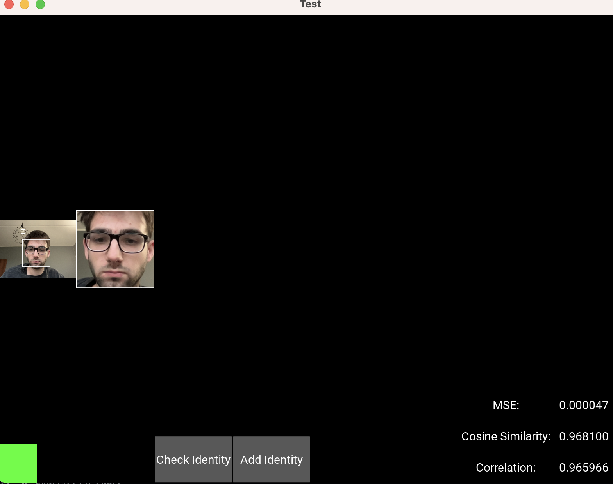
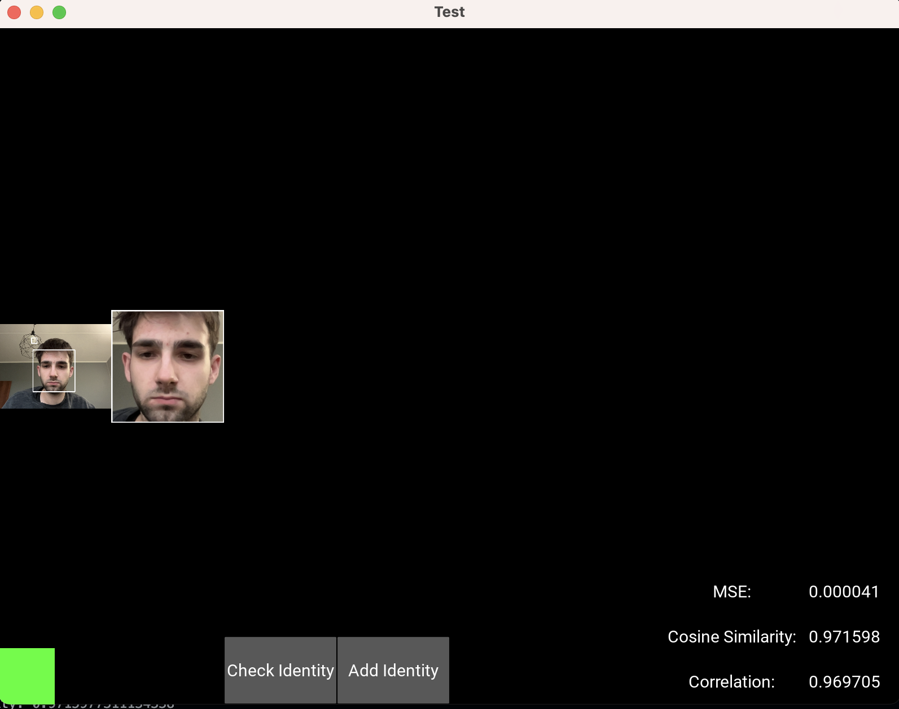
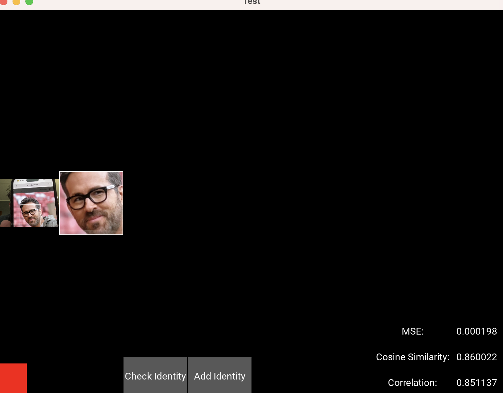
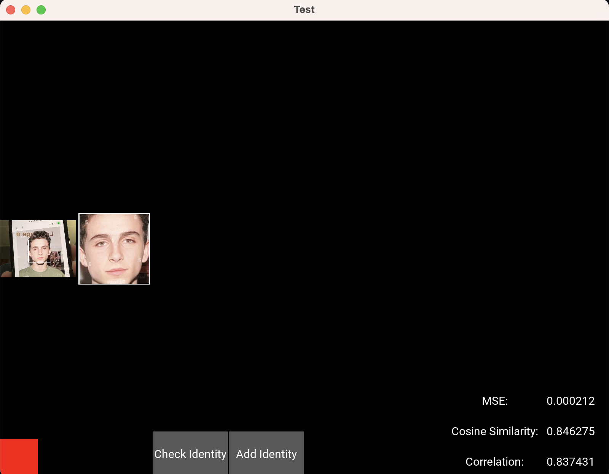

# Face_Recognition_System
Employment of Autoencoder/Variational Autoencoder for FaceID system based on the https://microsoft.github.io/DigiFace1M/ synthetic dataset. Application commpare encoded latent space of the given by camera face to the latent space of person added to database. 

Among tested similarity measures (such as MSE, Cosin Similarity and Pearson Correlation Coefficient) MSE shows best properties of distinguishing same identity with and without glsses as well as different identities

